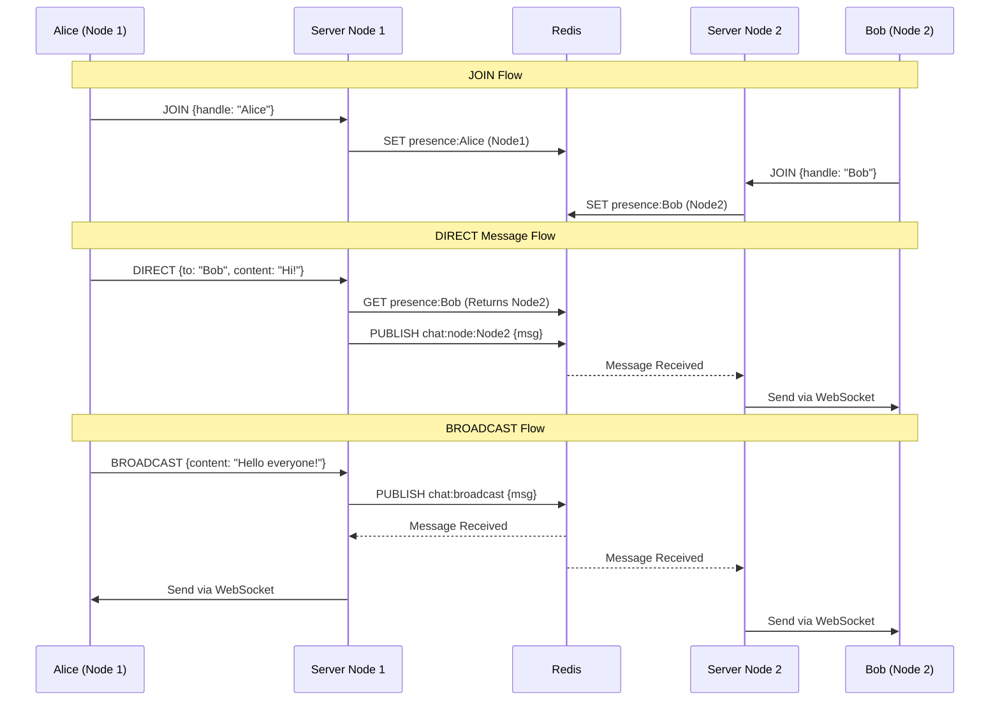

# Distributed Java WebSocket Chat

A highly scalable, real-time chat application built with Spring Boot 3, WebSockets, and Redis. It is designed to run across multiple server instances (nodes), using Redis as a distributed state store and message broker.

## Features
- **Real-time WebSockets:** Low-latency bidirectional communication.
- **Distributed Architecture:** Ready to scale horizontally across multiple instances.
- **Global Presence:** Users cannot claim the same handle, even if connecting to different nodes.
- **Efficient Message Routing:** Direct messages are routed only to the node hosting the recipient.
- **Virtual Threads:** Leverages Java 21+ Virtual Threads for high concurrency.

## Architecture

The application uses Redis Pub/Sub and Key-Value storage to coordinate state and messages between independent server nodes.

### 1. Global State Management
When a user connects and sends a `JOIN` message, the server checks Redis to ensure the handle is unique across the entire cluster. It then registers the user in Redis (`presence:<handle>`) mapping them to the specific server node they connected to. A background heartbeat keeps this presence active.

### 2. Message Broker (Pub/Sub)
- **Broadcasts:** Published to a shared Redis channel (`chat:broadcast`). All nodes listen to this channel and forward the message to their locally connected clients.
- **Direct Messages:** The sender's node looks up the recipient's node ID in Redis. It then publishes the message to a node-specific channel (`chat:node:<targetNodeId>`). Only the target node processes the message and delivers it to the specific client.

## Chat Protocol (JSON)

Communication happens via JSON payloads over the WebSocket connection.

| Type | Payload Example | Description |
| :--- | :--- | :--- |
| `JOIN` | `{"type":"JOIN", "handle":"Alice"}` | Request to join the chat. The server will respond with a `SYSTEM` message confirming the assigned handle. |
| `BROADCAST` | `{"type":"BROADCAST", "content":"Hello!"}` | Send a message to all users on all nodes. |
| `DIRECT` | `{"type":"DIRECT", "to":"Bob", "content":"Hi"}` | Send a private message. |
| `SYSTEM` | *(Server to Client only)* | Status updates (e.g., Welcome messages). |
| `ERROR` | *(Server to Client only)* | Error notifications. |

## Tech Stack
- Java 25
- Spring Boot 4.0.6
- Spring WebSocket
- Spring Data Redis (StringRedisTemplate)
- Jackson (JSON processing)
- Gradle 9.2.0 (Kotlin DSL)
